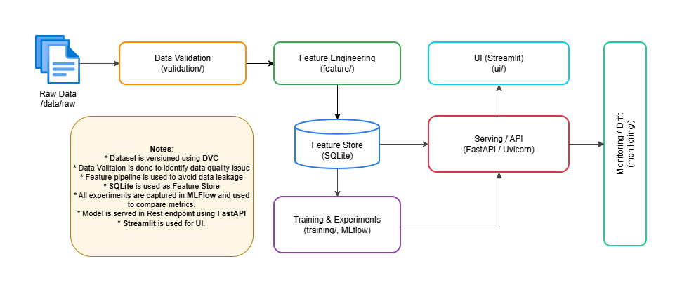

# Sentiment Analysis — High-Level Architecture

## Overview

This document gives a simple, high-level architecture for the sentimentanalysis_team3 project. It describes the main components, their responsibilities, how data flows through the system, and a compact component diagram.

## High Level Diagram:

Figure: High-level component diagram. If your viewer does not render it inline, open arch/component-diagram.drawio.png in the repository or view the image at ./component-diagram.drawio.png relative to this file.

## Key components (locations)

- Data (raw): ../data/raw/
  - Example files: [Amazon_Reviews_3500records.csv](../data/raw/Amazon_Reviews_3500records.csv)
- Data validation: [validation/data_validation.py](../validation/data_validation.py)
- Feature engineering / feature store: [feature/build_features.py](../feature/build_features.py)
- Model training & experiments: [training/train_with_mlflow.py](../training/train_with_mlflow.py)
- Model serving / API: [serving/api.py](../serving/api.py) (run with: uvicorn serving.api:app --port 8000)
- UI for demo: [ui/app.py](../ui/app.py) (Streamlit)
- Monitoring / drift analysis: [monitoring/analyze_drift.py](../monitoring/analyze_drift.py)
- Prediction logs/tools: [tools/read_prediction_logs.py](../tools/read_prediction_logs.py)
- Project README: [README.md](../README.md)

## High-level responsibilities

- Data Layer
  - Stores raw datasets used for training and evaluation.
  - Contains persistent artifacts produced by pipelines (features, trained models, logs).

- Validation Layer
  - Ensures input data schema, quality checks, and generates human-readable and machine-readable reports.
  - Prevents bad data from entering the feature pipeline.

- Feature Layer
  - Builds reproducible feature artifacts from validated raw data.
  - May persist features to a local feature store or files for training and serving.

- Training & Experimentation
  - Runs experiments and tracks runs via MLflow (sqlite or configured backend).
  - Produces serialized model artifacts and model metadata.

- Serving Layer
  - Exposes a REST API for predictions (FastAPI + Uvicorn suggested by README).
  - Loads model artifacts and feature pre-processing logic for online inference.

- UI Layer
  - Streamlit app for demo/visualization and human interaction with the model.

- Monitoring Layer
  - Collects prediction logs and runs drift detection, data quality alerts, and model performance checks.

## Data flow (simple)

1. Raw data placed in data/raw/ or fetched by collection process.
2. validation/data_validation.py validates data and writes reports & issues (validation_report.txt, validation_issues.json).
3. feature/build_features.py consumes validated data and produces feature datasets for training and serving.
4. training/train_with_mlflow.py trains models, logs metrics/artifacts to MLflow, and stores model binaries.
5. serving/api.py loads model + preprocessing to serve prediction requests (API) and logs predictions to a local log store.
6. monitoring/analyze_drift.py reads prediction logs and production data to detect drift and alert.
7. ui/app.py provides a demo interface that calls the serving API or runs local inference.

## Deployment & run notes

- Local dev: Use uvicorn for API, streamlit for UI, and MLflow UI for experiment tracking.
  - API: uvicorn serving.api:app --port 8000
  - Streamlit UI: streamlit run ui/app.py
  - MLflow UI: mlflow ui --backend-store-uri sqlite:///mlflow.db

- Persistence
  - MLflow backend-store default in README: sqlite:///mlflow.db
  - Prediction logs are read by tools/read_prediction_logs.py (see README for example commands)

## Notes and recommendations

- Keep preprocessing code shared between training and serving; place reusable transforms in feature/ or a common package to avoid training/serving skew.
- Use MLflow artifact storage for models to make serving load paths reproducible.
- Ensure prediction logs include request metadata (timestamp, batch id, input hash) to aid drift detection.
- Add automated unit tests around validation and feature-building logic to detect regressions early.